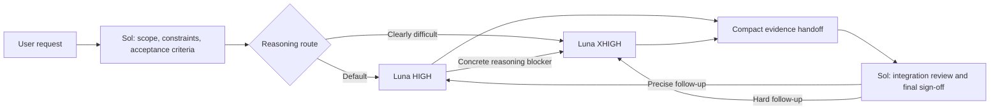

# Giangero ModelFlow for Codex

[](LICENSE)
[](https://github.com/giangero1/giangero-modelflow/releases/latest)

**Designed by Giangero Studio.**

**Use the right AI model for every job.**

Giangero ModelFlow is a conservative, cost-aware delegation configuration for Codex. It keeps the main GPT-5.6 Sol thread focused on orchestration, architecture, integration, and final sign-off while GPT-5.6 Luna workers own bounded production execution.

> [!IMPORTANT]
> This is an independent community configuration. It is not affiliated with or endorsed by OpenAI. OpenAI, ChatGPT, Codex, and GPT model names belong to their respective owners.

## What this workflow does

- Keeps Sol responsible for requirements, planning, task decomposition, final architecture, cross-cutting decisions, integration review, and final sign-off.
- Uses `luna_worker` at HIGH as the default production executor.
- Uses `luna_worker_xhigh` at XHIGH only for genuinely reasoning-heavy bounded work or evidence-based escalation.
- Gives Luna ownership of repository reading, implementation, tools, MCP interaction, compilation, logs, focused tests, repair iterations, and self-validation.
- Prevents Sol from needlessly repeating Luna's expensive searches, tool calls, compilation, or validation.
- Preserves final architectural and product authority with Sol.



## Internal benchmark evidence


In the recorded workflow benchmark, Sol Medium used **403,852 tokens** and performed no Unity MCP or implementation work, while Luna XHIGH used **4,230,396 tokens**, made **36 Unity MCP calls**, and owned coding, compilation, Console inspection, testing, retries, and validation.

These author-supplied internal results show the intended responsibility separation in the recorded runs; they are not presented as a general model-quality or efficiency benchmark. See the [full benchmark tables, interpretation, and limitations](docs/BENCHMARKS.md).

## Worker routing

### Luna HIGH — default

Use `luna_worker` for clear, bounded implementation; routine debugging; normal Unity or MCP work; compilation and Console fixes; localized refactoring; constrained root causes; and straightforward validation.

When uncertain between HIGH and XHIGH, choose HIGH.

### Luna XHIGH — difficult bounded work

Use `luna_worker_xhigh` when reasoning difficulty materially warrants it, including:

- genuinely unknown root causes;
- multiple interacting systems;
- networking, synchronization, replication, authority, or lifecycle behavior;
- concurrency and race conditions;
- intermittent or state-dependent bugs;
- contradictory evidence;
- unusually risky changes;
- extensive investigation or difficult correctness verification;
- escalation after HIGH repeatedly cannot resolve the package.

Work does not become XHIGH merely because it touches many files, requires many tool calls, takes a long time, is mechanically large, or has repetitive validation.

## Package contents

```text
AGENTS.md
agents/
  luna-worker.toml
  luna-worker-xhigh.toml
```

- `AGENTS.md` contains the Sol coordinator/Luna executor policy and routing rules.
- `agents/luna-worker.toml` defines `gpt-5.6-luna` with HIGH reasoning.
- `agents/luna-worker-xhigh.toml` defines `gpt-5.6-luna` with XHIGH reasoning.

## Requirements

- A current local Codex client with custom-agent support.
- Account access to `gpt-5.6-luna` and the configured reasoning efforts.
- Permission to modify your personal or project Codex configuration.

Custom-agent behavior and model availability may change between Codex releases. Review the [official OpenAI custom-agent documentation](https://learn.chatgpt.com/docs/agent-configuration/subagents) when upgrading.

## Installation

### 1. Download

Download the curated ZIP from the [latest GitHub release](https://github.com/giangero1/giangero-modelflow/releases/latest), or clone this repository.

### 2. Back up existing configuration

Back up any existing `AGENTS.md` and custom-agent files before installing. If you already have unrelated instructions, merge the delegation policy instead of replacing your file wholesale.

### 3. Install as personal agents

Windows:

```text
%USERPROFILE%\.codex\
  AGENTS.md
  agents\
    luna-worker.toml
    luna-worker-xhigh.toml
```

macOS or Linux:

```text
~/.codex/
  AGENTS.md
  agents/
    luna-worker.toml
    luna-worker-xhigh.toml
```

Copy or carefully merge `AGENTS.md`, then copy both TOML files into the `agents` directory.

### 4. Add project-specific rules

The distributed policy is deliberately project-neutral. Add project documentation requirements, protected paths, validation rules, architecture constraints, and other project-specific instructions separately in the appropriate `AGENTS.md`.

### 5. Restart Codex

Restart Codex so it reloads the custom-agent registry and instructions.

## Architectural authority

Luna may deeply investigate architecture, trace cross-system behavior, determine root causes, compare implementation approaches within a direction bounded by Sol, and execute difficult fixes.

If Luna discovers an unresolved architectural choice, conflicting requirement, authority ambiguity, or a decision that would materially change system boundaries, public contracts, or product behavior, it returns evidence and options to Sol. Sol decides and sends a revised bounded package back to Luna.

## Security and privacy

This repository intentionally excludes:

- `config.toml`;
- credentials and tokens;
- permissions and sandbox configuration;
- MCP server configuration;
- machine-specific runtime settings;
- private project rules or source code.

Review all configuration files before installing them in your environment. Custom agents inherit applicable parent-session settings that their files do not override.

## Release integrity

Each release includes a versioned ZIP asset. Its SHA-256 checksum is published in the release notes so you can verify the downloaded artifact.

## License

Released under the [MIT License](LICENSE).

Copyright © 2026 Giangero Studio.
