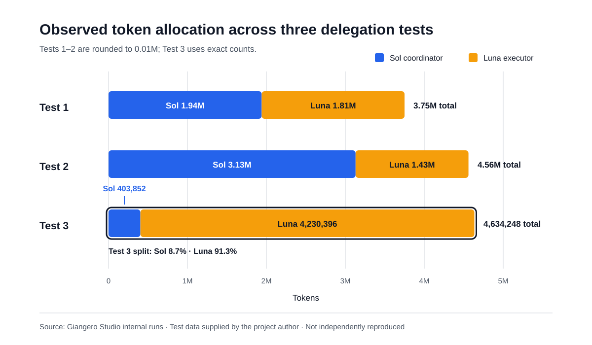

# Internal Benchmark Evidence

These results document three prior internal delegation tests supplied by Giangero Studio. They show how token usage and execution responsibilities were distributed between the Sol coordinator and Luna executor.

They are evidence that the workflow produced the intended role separation in these runs. They are not a general model-quality, cost, latency, or efficiency benchmark.

## Token allocation

| Test | Sol | Luna | Combined | Sol share | Luna share |
|---|---:|---:|---:|---:|---:|
| Test 1 | 1.94M | 1.81M | 3.75M | 51.7% | 48.3% |
| Test 2 | 3.13M | 1.43M | 4.56M | 68.6% | 31.4% |
| **Test 3** | **403,852** | **4,230,396** | **4,634,248** | **8.7%** | **91.3%** |

Tests 1 and 2 were recorded in rounded millions. Test 3 was recorded with exact token counts.

## Test 3 responsibility separation

| Activity | Sol Medium | Luna XHIGH |
|---|---:|---:|
| Tokens | **403,852** | **4,230,396** |
| Project read/review calls | 1 small final diff | 13 |
| Unity MCP calls | **0** | **36** |
| Coding | No | Yes |
| Compilation/refresh | No | Yes |
| Console inspection | No | Yes |
| Menu execution | No | Yes |
| Independent count testing | No | Yes |
| Validation retries | No | Yes |

Combined Test 3 usage was **4,634,248 tokens**.

## What Test 3 demonstrates

- Sol stayed in the coordinator/reviewer role and inspected only one small final diff.
- Sol performed no Unity MCP calls, implementation, compilation, Console inspection, menu execution, independent count testing, or validation retries.
- Luna performed the complete production and validation loop, including 36 Unity MCP calls and all repair iterations.
- The observed responsibility split closely matches the intended Sol-orchestrator/Luna-executor ownership model.

## Methodology and limitations

- The figures come from prior internal runs and have not been independently reproduced for this repository.
- Test 1 and Test 2 token counts are rounded to two decimal places in millions.
- Test 3 token counts and call counts are exact as recorded by the author.
- Scenario definitions, elapsed time, monetary cost, acceptance criteria, and raw logs are not currently published.
- Token allocation alone does not establish output quality. The strongest Test 3 evidence is the accompanying activity split showing which agent performed implementation and validation.
- Results may vary with Codex version, model availability, prompts, tools, repository size, and task complexity.

Future benchmark updates should publish repeatable scenarios, environment/version information, acceptance criteria, and raw or redacted logs where practical.
